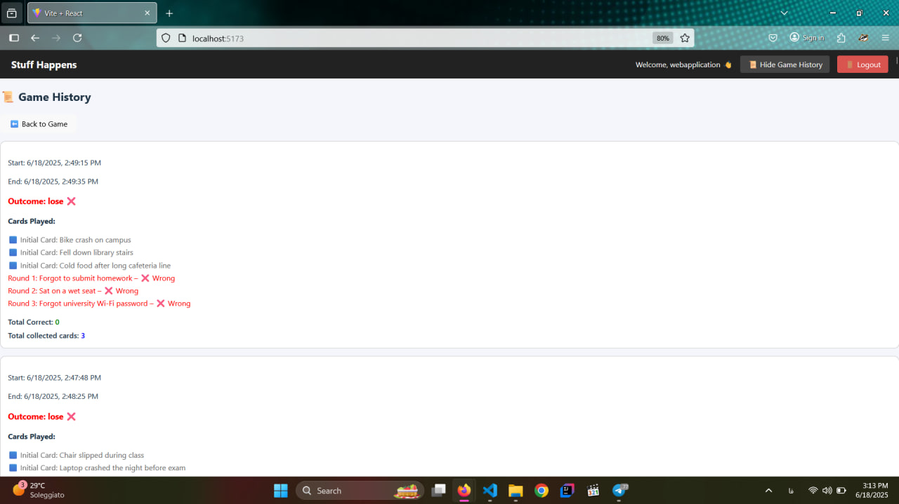
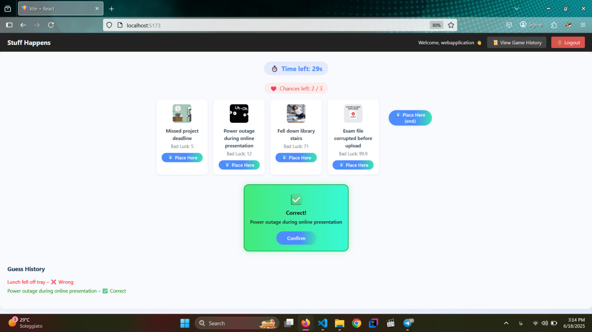

# Exam #1: "Stuff Happens"
## Student: [S343333@studenti.polito.it] [Mohammadreza Babaei]

---

## 1. Server-side

### HTTP APIs

- `POST /api/login`  
  - Body: `{ username, password }`  
  - Logs in a user and starts a session.

- `POST /api/logout`  
  - Logs out the current user and destroys the session.

- `POST /api/game/start`  
  - Starts a new game for the logged-in user and returns 3 initial random cards.

- `POST /api/game/next`  
  - Body: `{ used: [cardIds] }`  
  - Returns a new random card not among the provided IDs.

- `POST /api/game/guess`  
  - Body: `{ game_id, card_id, round_number, won, gameOver, outcome }`  
  - Saves the result of a guess for a card in a round.

- `PUT /api/game/:id/end`  
  - Body: `{ outcome }`  
  - Ends a game and sets its outcome (`win` or `lose`).

- `GET /api/profile`  
  - Returns the logged-in user's profile and game history.

- `GET /api/cards`  
  - Returns all cards (for admin/testing).

### Database Tables

- `Users` — Stores user accounts and login info.
- `Cards` — Master list of all possible cards (name, image, bad luck index, theme).
- `Games` — Metadata for each played game (user, start/end time, outcome).
- `GameCards` — All cards used in each game, with round number and result (won, missed, initial).

---

## 2. Client-side

### Routes

- `/login` — Login page for user authentication.
- `/game` — Main game interface for playing.
- `/history` — Game history for the logged-in user.
- `/` — Redirects to login or game depending on authentication.

### Main React Components

- `App.jsx` — Application root and routing.
- `LoginForm.jsx` / `ModernLoginForm.jsx` — User login form.
- `Game.jsx` — Main game logic and UI.
- `GameHistory.jsx` — Displays game history and past results.
- `DemoGame.jsx` — Demo version for anonymous users.

---

## 3. Overall

### Screenshots

- Game History page:  
  

- During a game:  
  

### User Credentials

- Username: `webapplication`  |  Password: `137800`
- Username: `fuvio`           |  Password: `politecnico25`

---

**Note:**  
- The app is designed for desktop browsers.
- To start:  
  1. `cd server && npm install && nodemon index.mjs`  
  2. `cd client && npm install && npm run dev`
- Demo accounts for testing:  
  - Username: `student1` | Password: `pass123`  
  - Username: `testuser` | Password: `abc123`
